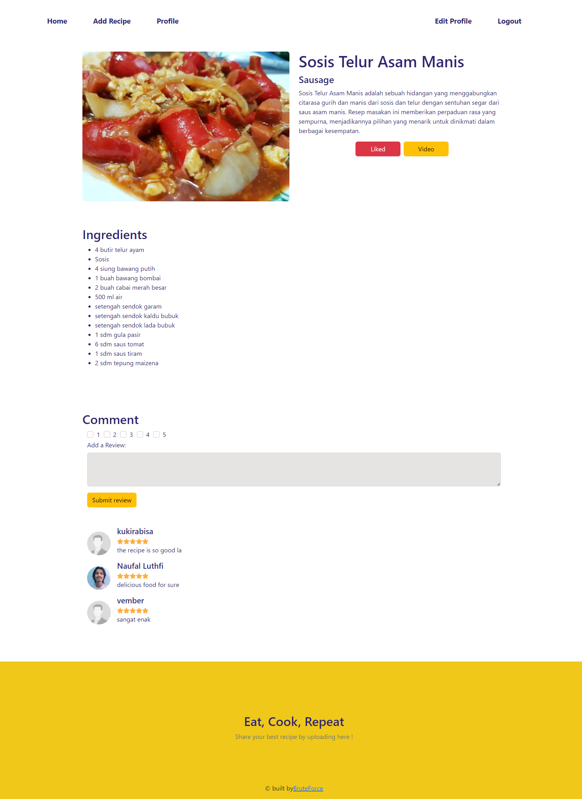
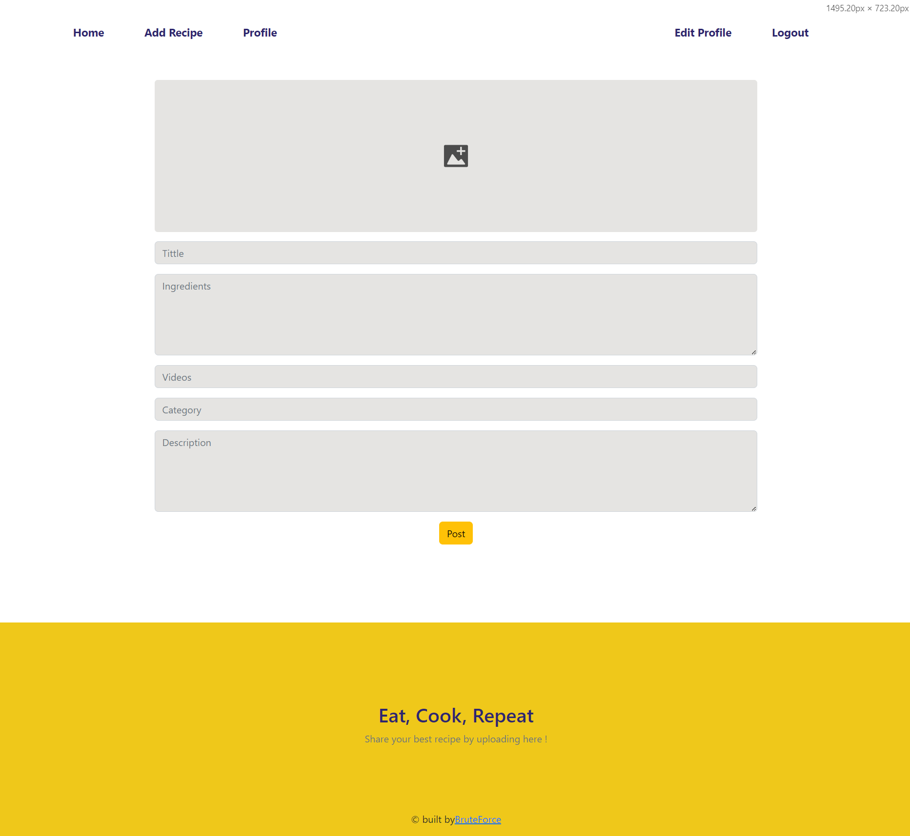
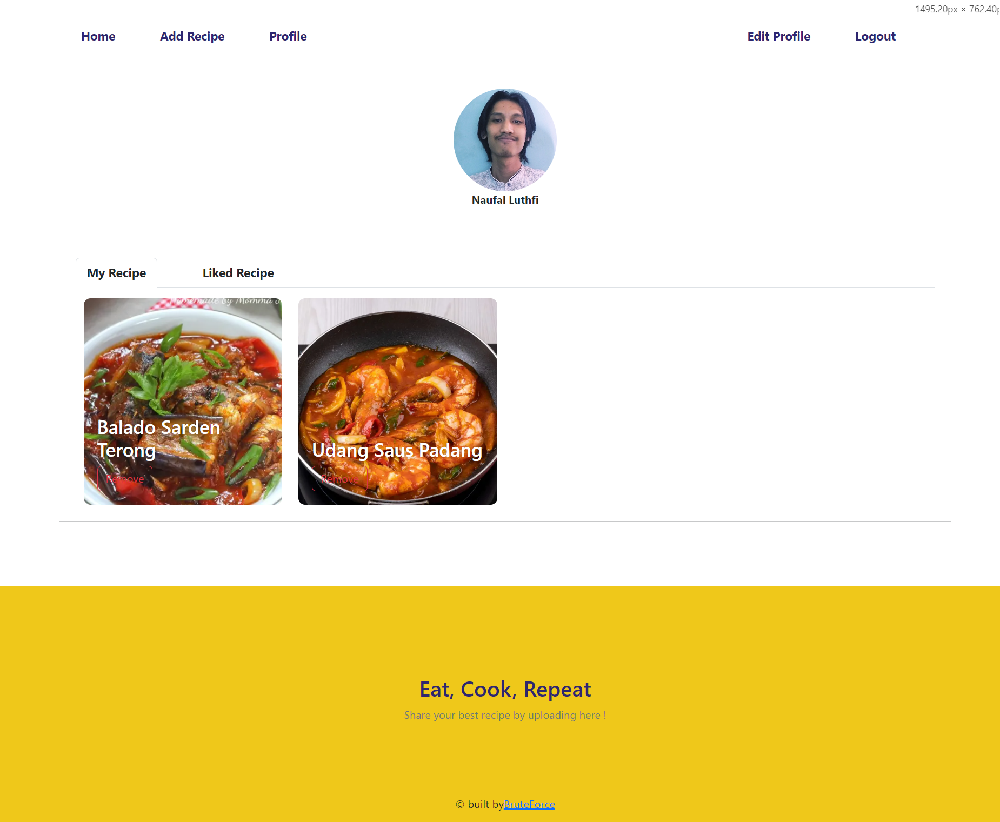
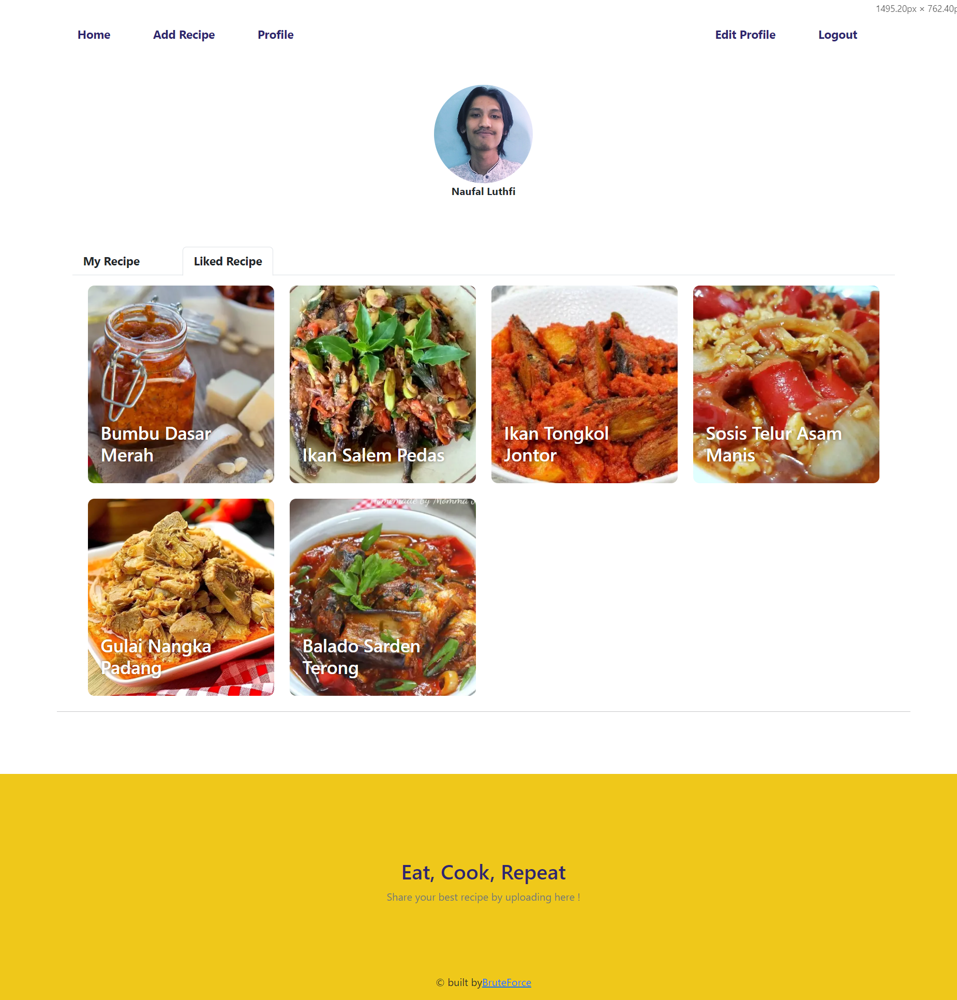
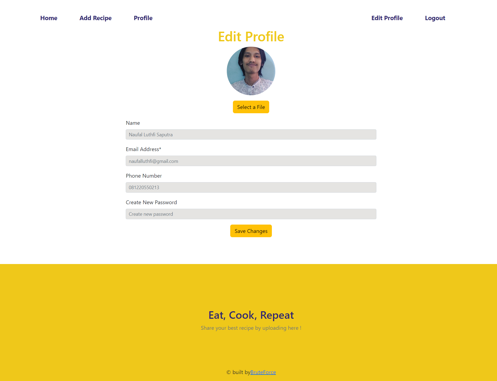

<br />
<p align="center">
  <h3 align="center">Pijar Food</h3>
</p>

<!-- ABOUT THE PROJECT -->

## About The Project

Pijar Food is a platform for viewing and sharing food recipes developed with React.js for the front-end and integrated into the PostgreSQL database using Express.js as the back-end for the platform.

### Project Structure

```
|── FE-REACT_PIJARFOOD
   |── public          # Public Assets
   |── documentation   # Screenshots of the application
   |── src             # Project source code
       |── components  # Application components
       |── pages       # Pages source code
       |── reducers    # State management
       |── styles      # Application CSS
   |── .env            # Environment variables
   |── .gitignore      # Files that should be ignored
   |── README.md       # Readme
```

### Features

<ul>
<li>User authentication (login, register)</li>
<li>View recipes and their details</li>
<li>Add new recipes</li>
<li>Like and comment/review recipes</li>
<li>Delete recipes</li>
<li>Edit profile</li>
</ul>

### Screenshots

<table>
<tr>
<td></td>
    <td> </td>
    <td> </td>
</tr>
<td></td>
    <td> </td>
</tr>
<td></td>
    <td> </td>
</tr>
<td></td>
    <td> </td>
</table>

## Below are lists of modules used in this application:

- [React JS](https://reactjs.org/)
- [Redux](https://redux.js.org/)
- [Bootstrap](https://getbootstrap.com/)
- [Axios](https://axios-http.com/)
- [Dotenv](https://www.npmjs.com/package/dotenv)
- [SweetAlert2](https://sweetalert2.github.io/)

# Getting Started with Create React App

This project was bootstrapped with [Create React App](https://github.com/facebook/create-react-app).

## Available Scripts

### `npm -i`

install the required modules

## In the project directory, you can run:

### `npm start`

Runs the app in the development mode.\
Open [http://localhost:3000](http://localhost:3000) to view it in your browser.

The page will reload when you make changes.\
You may also see any lint errors in the console.

### `npm test`

Launches the test runner in the interactive watch mode.\
See the section about [running tests](https://facebook.github.io/create-react-app/docs/running-tests) for more information.

### `npm run build`

Builds the app for production to the `build` folder.\
It correctly bundles React in production mode and optimizes the build for the best performance.

The build is minified and the filenames include the hashes.\
Your app is ready to be deployed!

See the section about [deployment](https://facebook.github.io/create-react-app/docs/deployment) for more information.

### `npm run eject`

**Note: this is a one-way operation. Once you `eject`, you can't go back!**

If you aren't satisfied with the build tool and configuration choices, you can `eject` at any time. This command will remove the single build dependency from your project.

Instead, it will copy all the configuration files and the transitive dependencies (webpack, Babel, ESLint, etc) right into your project so you have full control over them. All of the commands except `eject` will still work, but they will point to the copied scripts so you can tweak them. At this point you're on your own.

You don't have to ever use `eject`. The curated feature set is suitable for small and middle deployments, and you shouldn't feel obligated to use this feature. However we understand that this tool wouldn't be useful if you couldn't customize it when you are ready for it.

## Learn More

You can learn more in the [Create React App documentation](https://facebook.github.io/create-react-app/docs/getting-started).

To learn React, check out the [React documentation](https://reactjs.org/).

### Code Splitting

This section has moved here: [https://facebook.github.io/create-react-app/docs/code-splitting](https://facebook.github.io/create-react-app/docs/code-splitting)

### Analyzing the Bundle Size

This section has moved here: [https://facebook.github.io/create-react-app/docs/analyzing-the-bundle-size](https://facebook.github.io/create-react-app/docs/analyzing-the-bundle-size)

### Making a Progressive Web App

This section has moved here: [https://facebook.github.io/create-react-app/docs/making-a-progressive-web-app](https://facebook.github.io/create-react-app/docs/making-a-progressive-web-app)

### Advanced Configuration

This section has moved here: [https://facebook.github.io/create-react-app/docs/advanced-configuration](https://facebook.github.io/create-react-app/docs/advanced-configuration)

### Deployment

This section has moved here: [https://facebook.github.io/create-react-app/docs/deployment](https://facebook.github.io/create-react-app/docs/deployment)

### `npm run build` fails to minify

This section has moved here: [https://facebook.github.io/create-react-app/docs/troubleshooting#npm-run-build-fails-to-minify](https://facebook.github.io/create-react-app/docs/troubleshooting#npm-run-build-fails-to-minify)

## Related Project

:rocket: [`Backend`](https://github.com/nluthfis/PijarFood)

:rocket: [`React native`](https://github.com/nluthfis/pijar_food_mobile)

:rocket: [`Demo`](https://fe-react-pijarfood.vercel.app)
